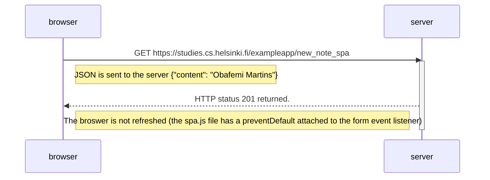

```mermaid
sequenceDiagram
    participant browser
    participant server

    browser->>server: GET https://studies.cs.helsinki.fi/exampleapp/new_note_spa
    activate server
    Note right of browser: JSON is sent to the server {"content": "Obafemi Martins"}
    server-->>browser: HTTP status 201 returned. 
    Note right of browser: The broswer is not refreshed (the spa.js file has a preventDefault attached to the form event listener)
    deactivate server
```